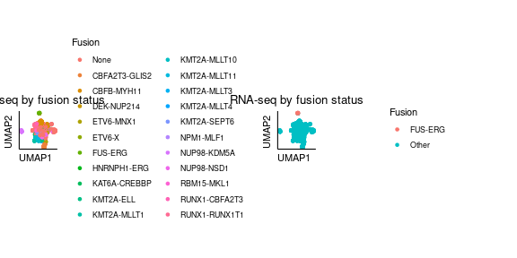

## Objective

To map the transcriptional signatures of immune-cold transplant-refractory AML.

In particular, to find out why FUS::ERG-driven AML is consistently immune-cold,
to determine if specific biological processes are shared across transplant-
refractory AML cases, and to see if this outcome can be predicted at diagnosis.


## Approach

### Steps 

Using the previously fitted rank-90 non-negative matrix factorization model, 

1. Identify factors describing specific signatures for cytogenetic subtypes.

2. Investigate biological processes underlying these factors using GSEA.

3. Determine if these factors are predictive of transplant-refractory AML.


## Analysis

We begin by loading the previously fitted NMF model (refer to TARGET_NMF.Rmd). 


```
## [1]   90 1630
```

Next we load the original annotated RNAseq data and check that everyone's there.


```
## [1] FALSE
```

### Slight hiccup 

Unfortunately we are missing some of the rarer fusions! We can fix that, though.
In the process we will recover a few others that slipped through earlier on. 
When we just need to update a model with some new observations, we can use the
singlet::ProjectData() function with our existing W matrix.


Let's take a quick look at a UMAP of (projected) dx NMF versus the original NMF.


It's not exactly identical to Zach's, but the FUS-ERG cases do split off. 
That's good enough for the time being. Let's add in the other fusions now.


```
## Error in file(file, "rt"): cannot open the connection
```

```
## Error in eval(expr, envir, enclos): object 'target_covs' not found
```

```
## [1] 1682
```

```
## [1] 1682
```


|fusion        | Freq|
|:-------------|----:|
|KMT2A-MLLT11  |    7|
|NPM1-MLF1     |    8|
|HNRNPH1-ERG   |    9|
|RBM15-MKL1    |   13|
|RUNX1-CBFA2T3 |   13|
|FUS-ERG       |   14|
|KAT6A-CREBBP  |   14|
|KMT2A-SEPT6   |   14|
|ETV6-MNX1     |   16|
|KMT2A-MLLT1   |   21|
|ETV6-X        |   25|
|NUP98-KDM5A   |   38|
|CBFA2T3-GLIS2 |   42|
|KMT2A-ELL     |   49|
|KMT2A-MLLT4   |   49|
|DEK-NUP214    |   55|
|KMT2A-MLLT10  |   92|
|KMT2A-MLLT3   |  126|
|NUP98-NSD1    |  137|
|CBFB-MYH11    |  186|
|RUNX1-RUNX1T1 |  218|
|None          |  536|


Let's feed the additional fusions, projected onto the original NMF, to the 
original UMAP model. 


We can fit factors to fusions:


```
## [1] "85"
```

```
## [1] 85
```

```
## STAB1 
##   261
```

```
## [1] "65" "73" "21" "48" "27"
```

```
## [1] 65
```

```
## CCND2 
##  4860
```

```
## character(0)
```

```
## [1] "76"
```

```
## TP53INP1 
##    11479
```

```
## [1] "21" "2"
```

```
## BAHCC1 
##  47621
```

```
## MALAT1 
##  39004
```

We can also fit some more interesting outcomes, albeit only for exploration:


```
##  [1] "16" "40" "87" "82" "45" "2"  "44" "46" "1"  "39" "48" "8"  "4"  "55" "90"
## [16] "15" "14" "5"  "68" "52" "7"  "12" "81" "9"  "78" "53" "89" "42" "11" "77"
## [31] "43" "31" "20" "3"  "10" "26" "6"  "80" "60" "29" "35" "34" "50" "18" "30"
## [46] "13" "47" "32" "86" "71" "33" "72" "17" "21" "28" "88" "36" "63" "22" "25"
## [61] "23" "61" "38" "62" "58" "19" "24" "41" "37" "69" "49" "27" "66" "54" "51"
## [76] "56" "57" "59" "83" "64" "70" "75" "67" "74" "76" "73" "79" "65" "85"
```

```
##  [1] "40" "87" "16" "82" "44" "2"  "45" "39" "52" "68" "15" "8"  "46" "1"  "14"
## [16] "4"  "48" "55" "5"  "90" "21" "81" "37" "9"  "7"  "31" "77" "89" "12" "78"
## [31] "53" "3"  "42" "20" "10" "43" "26" "6"  "30" "29" "80" "35" "51" "28" "18"
## [46] "34" "50" "33" "60" "13" "58" "86" "11" "72" "71" "47" "62" "23" "36" "66"
## [61] "41" "83" "38" "88" "49" "27" "32" "70" "22" "69"
```

We can also quickly check things out with iSEE:


Well, that looks good. 


### Figure panels: 

A. UMAP of TARGET pAML (n = 1682) samples colored by cytogenetic subtype.



B. Association of individual factors with FUS::ERG vs. all other pAML. 

C. Enrichnment of factors in cytogenetic subtypes of pediatric AML.

D. Pathway enrichment for factors associated with allo-SCT response.

E. Antigen presentation and immune response GSEA, FUS::ERG vs. other pAML.

